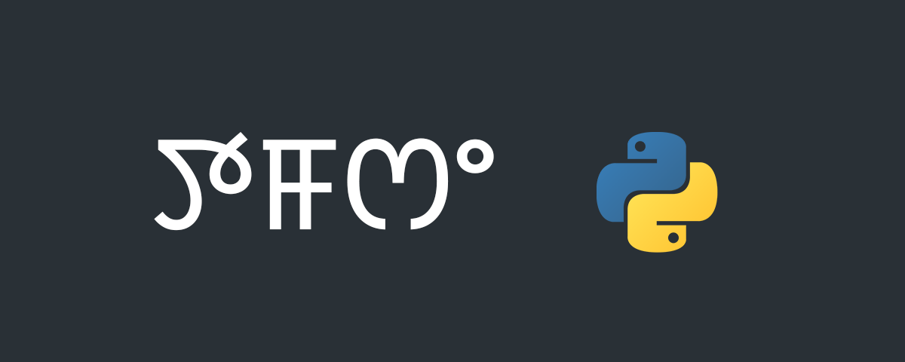

# ꯇꯝꯁꯦ Python

Introduction to **Python** Programming.

Python is an interpreted platform-independent language written in C.

What we will do?

1. Install Python Interpreter.
2. Write Python program.
3. Run it.
